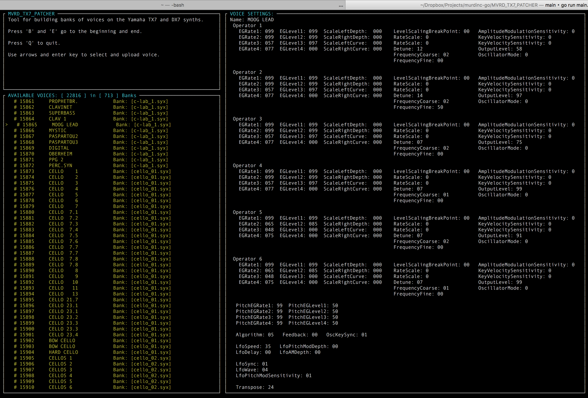

# MVRD_TX7_PATCHER
A simple cli tool for editing/managing the patches on the infamous Yamaha DX7/TX7 FM Synthesizers. 

The Yamaha DX7 was released in 1983, and turned out to be one of the most popular digital synths ever created. You can pretty much name any song released in the 80's and early 90's and it likely used tones synthesized with this hardware. It is still used today, and if you are familiar with the synth you can recognize it easily. It is also known as one of the most difficult synths to program patches on. The desktop version (TX7) has even fewer buttons than the full sized DX7, compounding the difficulty. 

There are tools like Sysex Librarian which will send an entire bank of 32 patches to the synth, And MidiQuest allows you to edit the patches, but its clunky and not a very enjoyable experience. I wanted a way to combine individual patches from the collection of .SXY files in public domain into custom banks, so that I wouldnt have to reprogram the whole bank to switch to a different sound. 

This uses a fork of the portmidi library that has been modified to expose the entire Message byte array.  

**Terminal User Interface:**

**Completed:**
* Reads in Sysex files and breaks it out into a struct showing values of each patch.
* Dumps Bank data from the DX7/TX7.
* Processes an entire directory of SYX files and presents them as a menu of selectable voices
* Packages and sends individual voices to Synth, allowing you to mix and match voices into a new bank.

**Coming Up:** 
* Ability to edit / create new voices. 
